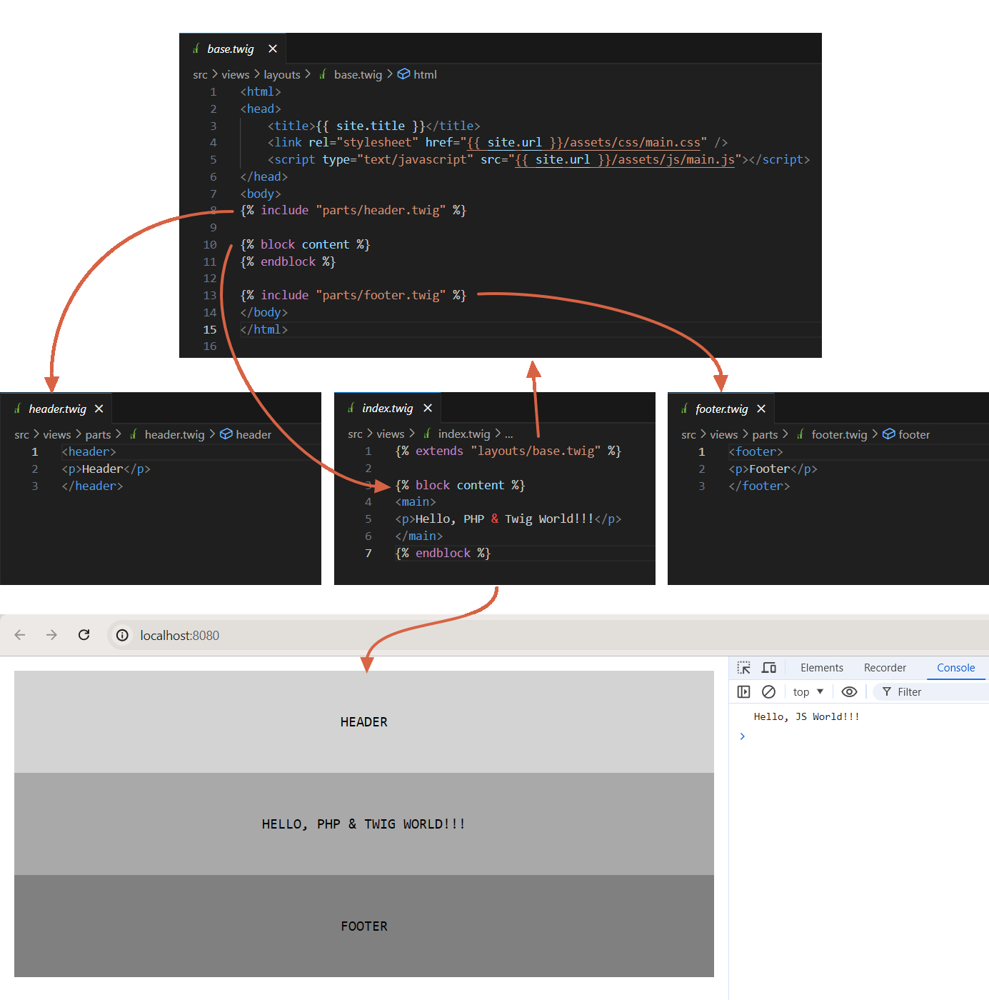

# Gulp with PHP & Twig Boilerplate

A simple and efficient boilerplate for PHP projects that combines the power of Gulp and the elegance of Twig. This boilerplate provides a solid foundation for rapid PHP development with a focus on automation and template rendering.

**Features:**
- Gulp: Automate repetitive tasks like minification, concatenation, and live reloading with ease.
- PHP: Leverage the flexibility and dynamic nature of PHP to handle server-side logic and data processing.
- Twig: Utilize the powerful and designer-friendly Twig templating engine for creating dynamic and reusable templates.
- Boilerplate Structure: Well-organized project structure with separate directories for assets, views, and PHP files.
- Automation: Gulp tasks to compile Sass/SCSS, minify CSS and JavaScript, and refresh your browser automatically during development.
- BrowserSync: Seamless synchronization of interactions and code changes across multiple devices and browsers.

Get started quickly with this boilerplate and streamline your PHP development workflow. It's perfect for building small to medium-sized websites, web applications, or even complex PHP-based systems. The combination of Gulp and Twig ensures a modern and efficient development experience.

**Getting Started:**

- Clone or download the repository.
- Install dependencies with `yarn install` and `composer install`.
- Run `gulp` to start the development server and watch for changes.
- Edit your Twig templates in the `src/views` directory and PHP files in the `src/inlcudes` directory.

**Requirements:**
- PHP 7.4 or higher
- Node.js and npm
- Composer

This boilerplate provides a solid starting point for your PHP projects, saving you time and effort in setting up a modern development environment. Focus on writing clean and efficient code while Gulp and Twig handle the heavy lifting.

## License

[MIT](LICENSE)